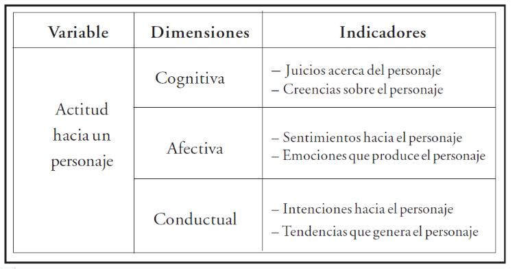
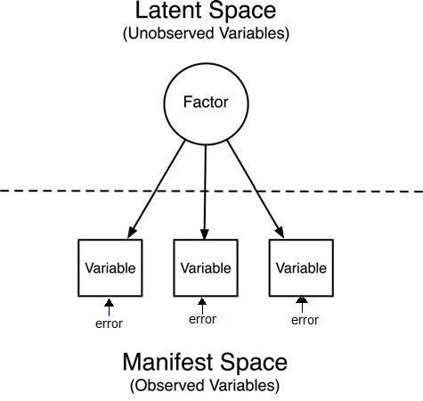
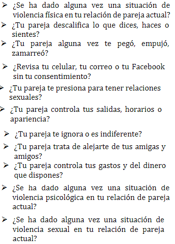
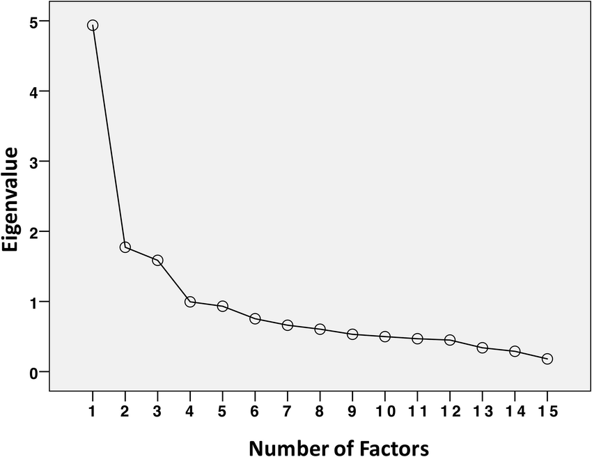
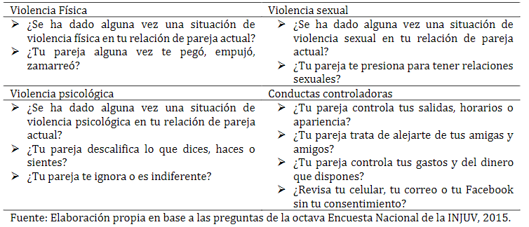

# El problema de la medición en ciencias sociales

- Variables observables y no observables directamente

- Ejemplos de variables "no observables" en ciencias sociales 

- Las variables latentes: medición indirecta

.center[

]
---
# Conceptos centrales de la medición 

- Fiabilidad

- Validez

---
## Modelos de medición y factores
.pull-left[
Operacionalizacion de los constructos

  + Teoría
  + Dimensiones
  + Itéms
  + Preguntas
  
  ]

.pull-right[
Evaluamos estadisticamente la calidad de la escala

  + Fiabilidad -  alpha de crombach
  + Validez interna - Análisis factorial
  ]
  
.center[  

]
---

# Analisis factorial Exploratorio

.pull-left[

> _¿Cuantas y cuales son las dimensiones poseen nuesto conjunto de variables?_

  __Conceptos centrales__

- Factores

- Cargas factoriales

- Comunalidad

- Varianza unica - Error de medición  

]

.pull-right[

]

???

Los factores se producen cuando existe covarianza entre los indicadortes. se presume que esta correlacion entre los indicadores se debe a que son causadas por la misma variable latante. (por ejemplo capacidad de multuplicar)

cuanto explica la variable latente al indicador

conjunto de covarianza entre los indicadores

el error de medición es la varianza que no es explicada por el factor comun. se interpreta como varianza del indicador que se debe a otra cosa (ejemplo prueba de mate con footbol.) (ejemplo medición de machismo. - gritar)

---

# Ejemplo breve

.pull-left[

__Lista de indicadores__

]

.pull-right[

__Analisis__

__Resultados__

]

???

En este punto entra en juego la imaginación sociologica, debemos evaluar como se denominan los factores. Hay que ponerle nombre en base a los indicadores que hay dentro. 

---

# Manos a la obra! - Pasos del AFE

1. Preparar los datos y hacer descriptivos

2. Hacer correlaciones

3. Evaluar condiciones de aplicación

4. Realizar analisis factorial exploratorio

 a. Determinar el numero adecuado de factores
 
 b. Revisar las cargas factoriales
 
 c. Nombrar las dimensiones.

---

