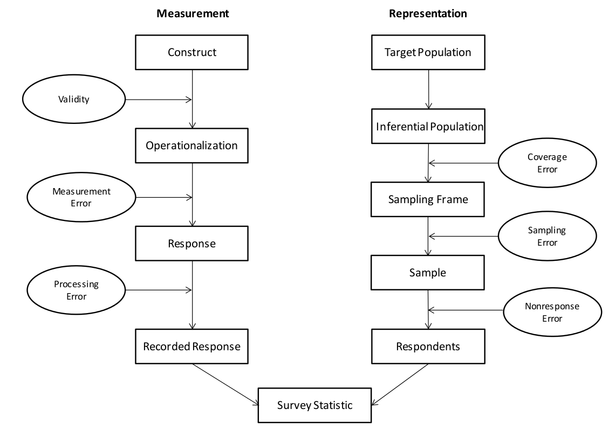
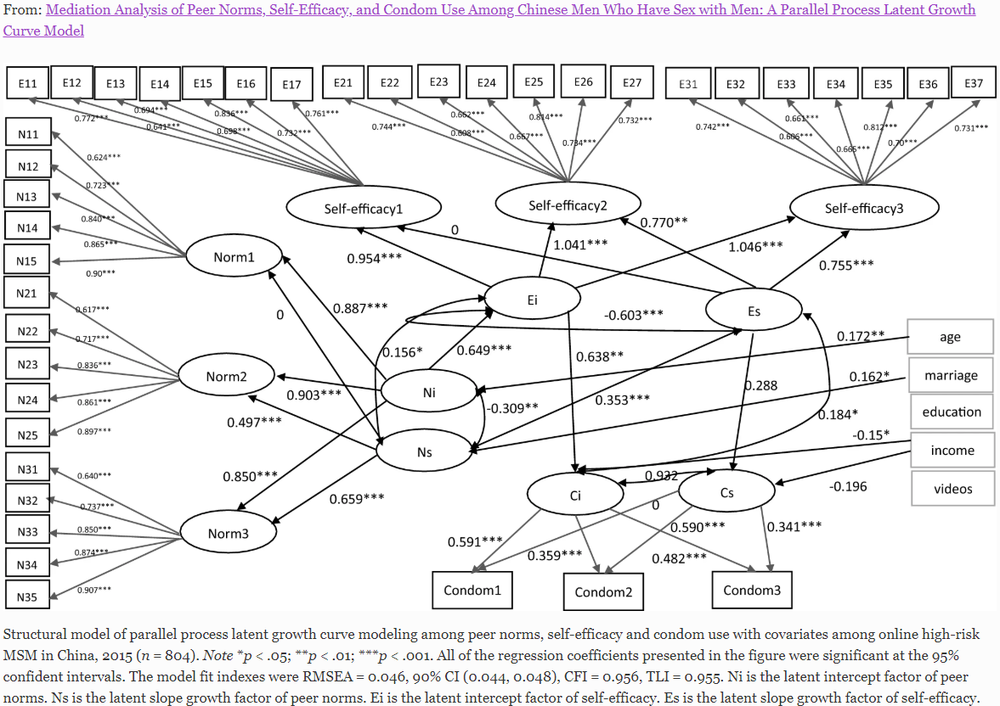
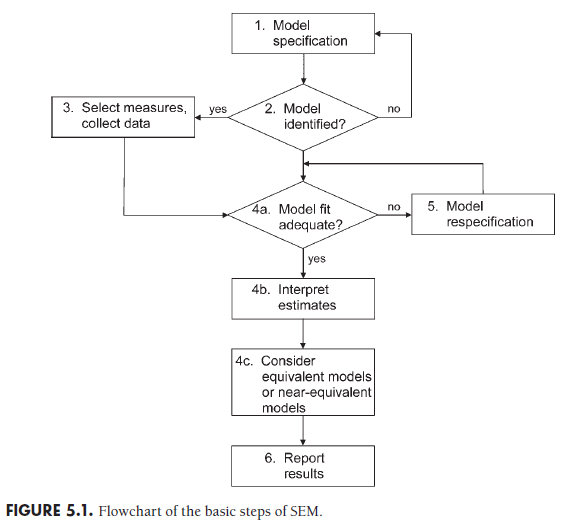

class: top, left

```{r xarin, include = FALSE}

#background-image: url(https://upload.wikimedia.org/wikipedia/commons/b/be/Sharingan_triple.svg)


#remotes::install_github('yihui/xaringan', upgrade = TRUE)
library(xaringanthemer)
#install.packages("Rcpp")
#install.packages("rlang")
#install.packages("backports")
#devtools::install_github("tidyverse/glue")
#devtools::install_github("gadenbuie/xaringanthemer")
#install.packages("digest")

#solarized_light(background_color="#FFF",
#                text_color="#000",
#                base_color = "#1c5253",
#                header_font_google = google_font("Josefin Sans"))

solarized_light(text_color = "#000000", header_color = "#dc322f",
  background_color = "", link_color = "#b58900",
  text_bold_color = "#000000", text_slide_number_color = "#93a1a1",
  text_font_google   = google_font("Work Sans", "500", "300i"),
  code_font_google   = google_font("IBM Plex Mono"),
  extra_fonts = NULL, outfile = "xaringan-themer.css")

#mono_light(
  #base_color = "#1c5253",
 # header_font_google = google_font("Josefin Sans"),
  #text_font_google   = google_font("Montserrat", "300", "300i"),
  #code_font_google   = google_font("Droid Mono")
#)

knitr::opts_chunk$set(echo = TRUE)
knitr::opts_chunk$set(warning = FALSE)
knitr::opts_chunk$set(message = FALSE)
#knitr::opts_chunk$set(dev = 'jpg')
# remove all previous objects
rm(list = ls()) 
```

---
# El problema de la medición en ciencias sociales

- Variables observables y no observables directamente

- Ejemplos de variables "no observables" en ciencias sociales 

- Las variables latentes: medición indirecta


---

# Conceptos centrales de la medición 

- Fiabilidad

- Validez

---

# Modelos de medición y factores

- Debemos trabajar teoricamente el constructo

- Pensamos cuales son las dimensiones del constructo

- Construimos indicadores de cada dimensión.


---

# Ejemplo de modelo de medición


---
# Error total: fuentes de error



---
# Variables latentes

- Indirectamente observables: hipotéticos

- Se deprenden de la observación de indicadores (p.e. items)

- Múltiples indicadores que covarían, podrían interpretarse como un factor común

---
# Variables latentes

- Teoría Clásica de Test:

$$X = T + E $$
$$ \sigma^{2}_x = \sigma^{2}_t +  \sigma^{2}_e$$
- La existencia de multiples indicadores permite aislar:

varianza común $$\sigma^{2}_t$$ y varianza única $$\sigma^{2}_t$$


---
# Análisis Factorial

- Conjunto de métodos para explicar correlaciones entre variables interpretables como variables latentes o factores

- La existencia de un factor común explicaría la asociación entre indicadores

- Dependencia condicional: las correlaciones serían 0 si se parcializa el factor.

---
# Propósito

- Reducir complejidad e incrementar la comprensión

- Validar una escala en términos del constructo que mide

- Separar varianza única de varianza común


---
# Fundamentos generales

- Covarianza, correlación y correlación parcial

- Regresión simple y múltiple

- En general, se pueden considerar los mismos supuestos de regresión líneal

---
# Supuestos 
- Nivel de medición intervalar 

- Normalidad de las mediciones (multivariada)

- Relación líneal entre variables

- Correlaciones deben tener cierto nivel para su agrupación

- Tamaño muestral: >200 casos o entre 5-10 casos por variable

---
# Diagramas


---
# ¿Parsimonia?


---
# Tres métodos

- Análisis de componente principales: Deficinición de componente a partir de una combinación líneal de variables

- Análisis Factorial Exploratorio: técnica descriptiva que permite determinar un número apropiado de factores latentes a un set de indicadores, separando varianza común de varianza única

- Análisis Factorial Confirmatorio: técnica que permite hipotetizar (y confirmar) una variable latente, especifícando una serie de parámetros 

---
# Tres métodos


---
# Procesos de estimación

---
# Ejemplo: Confianza en Instituciones Políticas


---

.center[]

---

class: center, middle

# Hands on!

